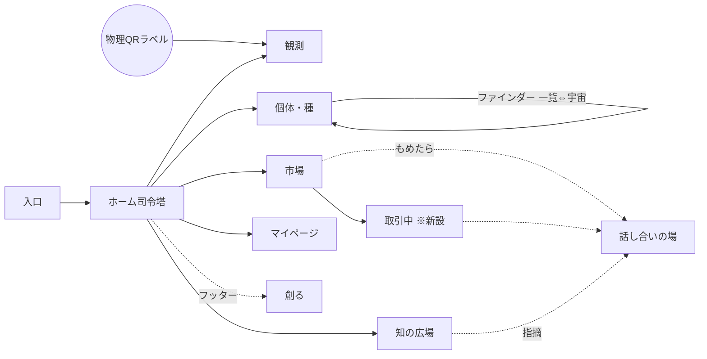

# C9 構造正本 — 骨子(第1判断用ドラフト)

> **この文書で決めることは1つだけ**: トップ構造(9ゾーン+目的宣言)と語彙方針(+初期10語)を、C9の全画面ラウンドの土台として承認するか。
> 55画面それぞれの統合/廃止・中身の設計はここでは**決めない**(後続ラウンドで1ジャーニーずつ判定)。
> 承認されたら `status: active` に昇格。以後の全UI変更は本正本との整合が納品条件(KICKOFF-c9-quality 契約3)。

- 悩みの逐語(この文書が解く問題): 「これUIの設計というか本当に何が必要、遷移設計、とかFableが監督したり、考えたりしましたか?」(受領11・15点)/「画面遷移・全体の設計はちゃんとできているの?」(R44)
- データソース: `screen-defs/*.json` 実数55件(navigation.json除く)・renderer.tsx グローバルナビ実装・到達可否は全navigate/href実grep(2026-07-17調査)

## 1. 画面マップ骨子 — 9ゾーン+新設2

各ゾーンに「ユーザーはなぜここに来るか」を1行宣言する。**現55画面は全て下表のどこかに1回だけ載る**(検算§4)。

| ゾーン | 目的宣言(なぜ来るか) | 画面数 | 所属画面(現状の実在id) |
|---|---|---|---|
| 入口 ENTRY | 初めて/再訪の人が迷わず自分の作業場に入る | 6 | login / login-sent / terms / setup-profile / country-select / language-select |
| ホーム司令塔 HOME | 今日やること・届いた出来事を10秒で把握して次へ飛ぶ | 1 | home |
| 観測 OBS | 目の前の個体の変化を最少クリックで記録する(全機能の一次データ) | 20 | obs-register / obs-register-entry / obs-register-new / obs-register-batch / obs-register-batch-confirm / obs-register-batch-done / obs-register-clutch / obs-register-confirm / obs-register-done / obs-freetext / obs-entry / obs-confirm / obs-domain-select / obs-search / obs-navigator / obs-detail / obs-templates / device / placement-qr / qr-resume(物理QR入口) |
| 個体・種 IND | 理想の個体を見つけ、個体の物語(血統・成長)を辿る | 5 | individual-detail / bio-card / cross / match / species |
| 市場 MKT | 安心して買う・出す。取引の今を見失わない | 3 | market-trade / economy-status / platinum-shop |
| 創る FORK | 良いテンプレを真似て・作って・共有して得をする(コピーされた方が得) | 2 | template-market / ui-templates |
| 知の広場 KNW | みんなの記録と論文から答えを探し、議論する | 11 | knowledge-hub / knowledge-board / knowledge-thread / knowledge-paper / knowledge-github / paper-match / paper-detail / data-descriptor / project-hub / research-search / research-newspaper |
| 話し合いの場 HAN | もめごと・指摘を当事者同士で落ち着いて解決する | 1 | dispute |
| マイページ ME | 自分の状態(信頼・資産・設定)を確認して整える | 6 | profile / settings / ai-profile-settings / ai-sessions / costs / theme-gallery |

**新設2(いずれもユーザー裁定済み・本判断の対象外=位置の確認のみ)**

| 新設 | 位置 | 根拠 |
|---|---|---|
| 個体ファインダー(一覧⇔宇宙) | IND内の探索モード。トップナビ項目にはしない | R45「絶対にIHLver3に実装する」/ design-individual-finder.md §4 |
| 取引中(独立画面) | MKT隣接。ホームに件数表示 | round-16裁定「取引中=独立画面」 |

## 2. 遷移骨子(主要導線のみ)

- 破線=「…」メニュー等からの補助導線。ゾーン内部の遷移は各ジャーニーのラウンドで確定する。

## 3. 語彙辞書骨子 — 方針3行+初期10語

方針(全画面ルール):

1. スキーマ名・ID・開発用語は画面に出さない。出したくなったらこの表に追記してから使う。
2. 新語・専門語は初出画面に1行説明を添える。
3. 迷ったらユーザー自身の言葉(逐語フィードバック)を正とする。

| # | 内部用語(UIに出さない) | UIで使う言葉 | 出典 |
|---|---|---|---|
| 1 | dispute / 相談室 / 二人部屋 | 話し合いの場 | round-16裁定(汎用調停ルーム)・受領11「相談室ってなんだよ」 |
| 2 | 買い手/売り手(役割ラベル) | 出さない(自分に関係あるボタンだけ表示) | 受領10必須①(実装済み方針) |
| 3 | actor_id等の生ハッシュ | 表示名 | 受領10(実装済み方針) |
| 4 | listing/trade等のID露出 | 対象カード(写真+名前)。IDは詳細の隅 | 受領10/11の内部語指摘から導出(redesign-round2分析) |
| 5 | 「この出品取引」等の複合内部語 | 「買う」「出品」「取引中」 | 受領11逐語 |
| 6 | 6次元観測ベクトル(生値) | 形質プロファイル | design-individual-finder.md:68 |
| 7 | telemetry / テレメトリ | 環境データ | 新規提案 |
| 8 | karma(内部名) | 貢献度 | round-16(フォーク10%=貢献度) |
| 9 | Truth / R2 / append-only 等の基盤語 | 出さない。必要時のみ「記録は書き換えられません」 | 新規提案 |
| 10 | fork | フォーク(初出画面に「=コピーして自分版を作ること。コピーされた方が得」の1行説明) | フォーク文化(不変条項②・ユーザー哲学語として維持) |

出典の正直表示: 1〜5は未承認分析資料(ui-redesign-round2.md)からの引き継ぎで、**この承認により正式化**される。7・9は新規提案。

## 4. 検算(実データ)

- ゾーン割当合計 = 6+1+20+5+3+2+11+1+6 = **55** = `screen-defs/*.json` 実数(navigation.json除く)。重複なし・漏れなし。
- 再現コマンド: `node -e "console.log(require('fs').readdirSync('screen-defs').filter(f=>f.endsWith('.json')&&f!=='navigation.json').length)"`

## 5. 正直表示(この骨子が言わないこと)

- 研究系5画面(paper-detail / data-descriptor / project-hub / research-search / research-newspaper)は**現在UI導線から到達不能**(実測)。KNWに置いたのは棚卸しであり、導線新設/凍結の裁定は後続ラウンド。
- OBS内の重複3画面(obs-entry / obs-confirm / obs-domain-select)には退役候補の分析が存在するが、本判断には含まない。
- ファインダーの胸角mm sort・全個体の宇宙座標はバックエンド未実装。第1ラウンドのスライスは「一覧+詳細+血統」まで(KICKOFF)で、未接続部は画面内に正直表示する。

## 6. 判断のお願い(1つだけ)

**この骨組み(9ゾーン+目的宣言+語彙方針10語)をC9の土台として承認しますか?**
承認 / 部分修正(どこをどう直すか) / 差し戻し — HQレビューハブのカードから採点・コメントできます。
