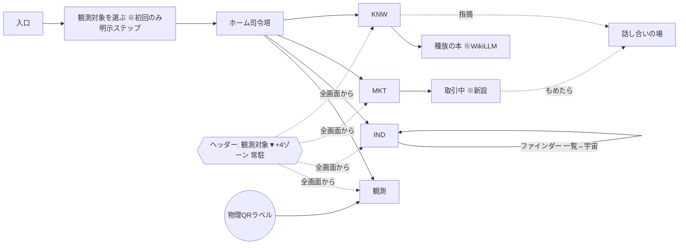

# C9 構造正本 v2 — 「観測対象」を軸にした全体構造

> **v2の位置づけ(2026-07-19)**: v1(9ゾーン+語彙10語)はユーザー承認済み(R50・2026-07-18「承認します。とてもレビューしやすかったです」)で**凍結**。v2はそれを**変更せず内包**し、上位構造として「観測対象=グローバル文脈スイッチ」を追加する。v2の追加分は**ユーザー承認済み(IA正本v2=R115○採用・カード`ia-canon-v2-2026-07-19`／home v2付帯指摘=R112「観測対象セレクタはヘッダー級へ昇格」)**。以後の全UI変更・全ゾーンスレッドの納品条件は本v2との整合。
> 出典(この構造が解く悩み・逐語): 「種族絞り込みの意図把握できていない。だから、遷移や、どこに何を配置するが収束しないんですよ」(R114)/「言語選択の次のレベルくらいの絞り込み…昆虫だけで、ヘラクレスのDHHだけを選んだら、99%のデータはもう見ることないですからね。ヘッダーあたりにあるくらい」(R112)

---

## 0. v2の一言(全体を貫く原理)

**このシステムは「観測対象を選んでから使う物」である。** 種族絞り込みは検索機能でもフィルタ機能でもなく、**システムの入口構造**。言語選択と同格のグローバル文脈であり、選んだ瞬間に全ゾーン(ホーム/観測/個体/市場/知の広場/wiki)がその観測対象の世界に切り替わる(**99%のデータは見えなくなるのが正**)。これがv1に対する唯一の構造的追加であり、「遷移・配置が収束しない」の根治である(遷移の中心をホームからヘッダーへ移す)。

---

## 1. 新設: グローバル文脈スイッチ「観測対象」(全画面共有chrome)

| 項目 | 決定 |
|---|---|
| UI上の名前 | **観測対象**(語彙辞書#11。「種族フィルタ」「スコープ」等の内部語は画面に出さない) |
| 位置 | **ヘッダー常駐**(全画面共通)。ロゴの隣=言語選択と同格。ホーム本文ブロックからは撤去(=昇格) |
| 選択の粒度 | 階層: ドメイン(昆虫)→種族(ヘラクレス)→系統/血統(DHH)。**どの深さでも選べる**。複数選択可+「すべて」 |
| 選択の手段 | セレクタを開くと既存の3モード(名前で探す/はい・いいえで絞る=アキネーター/分類からたどる)を**そのまま再利用**(`screen-defs/obs-navigator.json` の target-navigator ノード実装済み。新規開発ではなく昇格・配線) |
| 効果(スコープ) | 選択中の観測対象が**全ゾーンの既定絞り込み**になる: ホームのタイル/届いた出来事・個体ファインダー・宇宙ビュー・市場の出品一覧・知の広場の板/スレ/wiki・観測の個体一覧。**選択後はシステム全体が当該対象のデータだけを見せる(99%を隠す)** |
| 永続 | ユーザーごとに保存(最後の選択を次回も既定に)。切替はいつでも1クリック |
| 例外(絞らない画面) | 入口ENTRY(ログイン等)・設定・話し合いの場(当事者スコープ)・全体経済status。例外画面は「全観測対象の情報です」と正直表示する |
| 実装の型 | caseB7直系ファインダーの種族チップ絞り込み(100点採用R54/R70)と同じ思想を**システム全体へ持ち上げる**。API層は各listエンドポイントにクエリパラメータ(`species`/`lineage`スコープ)を統一敷設 |

### 1b. 補記(意図忠実性監査 T-74・2026-07-19)

- **(a) 既存根拠 — 新発明ではない**: ヘッダー観測対象ナビゲータは**V3-UIX-28**(srs.md:480「全画面共通のブランドクロム: ヘッダーに観測対象ナビゲータ・マイページ・通知・設定…」・確定・v1_tier中)の**回収**である。v1構造正本策定時にこの既存確定要件が見落とされていた(fidelity-A5 #2)。IA v2は新規発明ではなく既存要件の実装への接地である。
- **(b) 名称衝突の注記(UIで混同させない)**: 既存画面 `obs-navigator`「観測対象を特定する」=**1回の観測記録**の対象種を決める(画面ローカル・一時。確定すると obs-entry に species_candidate をプレフィル)。本書のヘッダーセレクタ「観測対象」=**アプリ全体**の表示スコープ(グローバル・永続)。**同名・同UI部品(target-navigator)流用だが別概念**(fidelity-A1 #6)。UI文言では、ヘッダー側は「今この対象を見ています」という現在スコープの提示、obs-navigator側は「この記録の対象種を選ぶ」という記録単位の選択として書き分ける。
- **(c) V3-UIX-28フッター部の失効**: 同要件の**フッター横並び(愚痴07g/改善提案07b/投票/Builder16)は STRIP-1(R95・共有chrome剥がし・push済`79a9272`)で撤去済み**。置換先=愚痴・改善提案→**話し合いの場**(HAN・§後述)、Builder→**創る**(FORK・ホーム内カード+マイページ配下)。V3-UIX-28のうち生きているのは**ヘッダーの観測対象ナビゲータ**部分。要件文の追従はround-18でF系裁定と併せて反映。

---

## 2. ヘッダー(全画面共有chrome)の確定形

```
[ロゴ] [観測対象セレクタ▼] | 観測  個体  市場  知の広場 | [届いた出来事🔔] [マイページ]
```

- **4主要動線(観測/個体を探す/市場/知の広場)=ヘッダー常駐**(R108①)。ホームを経由しなくても全画面から1クリックで移動できる。
- **v1「HOME=ハブ」→v2「ヘッダー=ハブ、HOME=司令塔ダッシュボード」**。これが「遷移が収束しない」の根治: 遷移図の中心はホームでなくヘッダー(§4)。
- ホームの役割を再定義: **今日やること・届いた出来事を10秒で把握する場所**(v1目的宣言のまま)。ナビゲーションはヘッダーの仕事。
- 二次項目はヘッダーに出さない: 創る(FORK/UIビルダー)=ホーム内カード+マイページ配下、テーマ⊂UIテンプレ、コスト/デバイス⊂設定(R108②④)。
- **UIビルダー(FORK)は絶対に落とさない**(R108追記=「全観測対象・全員に対応」の適応性の中核機構)。現況の正直表示: 保存/フォークのAPIは在るが**本体(組み立て画面)は未実装**=ホームに入口のみ確保。ライト/ヘビーUI切替方式は**F-4裁定(T-22クローズ・round-18採番)**で確定済み。
- モバイル: ヘッダー=[ロゴ][観測対象▼][🔔]+下タブ4ゾーン(V3-UIX-39のレスポンシブ標準形と整合)。

---

## 3. 画面マップ — 9ゾーン+新設2(v1から無変更・凍結)

各ゾーンに「ユーザーはなぜここに来るか」を1行宣言する。**現55画面は全て下表のどこかに1回だけ載る**(検算§6)。

| ゾーン | 目的宣言(なぜ来るか) | 画面数 | 所属画面(現状の実在id) |
|---|---|---|---|
| 入口 ENTRY | 初めて/再訪の人が迷わず自分の作業場に入る | 6 | login / login-sent / terms / setup-profile / country-select / language-select |
| ホーム司令塔 HOME | 今日やること・届いた出来事を10秒で把握して次へ飛ぶ(ナビはヘッダー) | 1 | home |
| 観測 OBS | 目の前の個体の変化を最少クリックで記録する(全機能の一次データ) | 20 | obs-register / obs-register-entry / obs-register-new / obs-register-batch / obs-register-batch-confirm / obs-register-batch-done / obs-register-clutch / obs-register-confirm / obs-register-done / obs-freetext / obs-entry / obs-confirm / obs-domain-select / obs-search / obs-navigator / obs-detail / obs-templates / device / placement-qr / qr-resume(物理QR入口) |
| 個体・種 IND | 理想の個体を見つけ、個体の物語(血統・成長)を辿る | 5 | individual-detail / bio-card / cross / match / species |
| 市場 MKT | 安心して買う・出す。取引の今を見失わない | 3 | market-trade / economy-status / platinum-shop |
| 創る FORK | 良いテンプレを真似て・作って・共有して得をする(コピーされた方が得) | 2 | template-market / ui-templates |
| 知の広場 KNW | みんなの記録と論文から答えを探し、議論する | 11 | knowledge-hub / knowledge-board / knowledge-thread / knowledge-paper / knowledge-github / paper-match / paper-detail / data-descriptor / project-hub / research-search / research-newspaper |
| 話し合いの場 HAN | もめごと・指摘・改善要望を当事者同士で落ち着いて解決する | 1 | dispute |
| マイページ ME | 自分の状態(信頼・資産・設定)を確認して整える | 6 | profile / settings / ai-profile-settings / ai-sessions / costs / theme-gallery |

**新設2(ユーザー裁定済み・位置の確認のみ)**

| 新設 | 位置 | 根拠 |
|---|---|---|
| 個体ファインダー(一覧⇔宇宙) | IND内の探索モード。**種族narrowingはヘッダーの観測対象セレクタ経由**(ファインダー内の種族チップはヘッダー選択の下位ファセット。IA v2統合済み) | R45「絶対にIHLver3に実装」/ design-individual-finder.md §4・caseB7版100点採用(R54/R70) |
| 取引中(独立画面) | MKT隣接。ホームに件数表示 | round-16裁定「取引中=独立画面」・mkt予想図100点(R121) |

**v2の配置注記(意図忠実性監査 T-74)**:
- **FORK配置**=ホーム内カード+マイページ配下(**footerのみは旧**=STRIP-1で撤去。R108追記+IA v2)。
- **IND行のmatch(match.json)**=好み学習型(気晴らし・寄り道の探索)。婚活的な相手探しではなく個体・好み学習に限定(V3-UIX-21・fidelity-A5 #8)。IND本線(理想個体を探す)とは別動線。

---

## 4. 遷移骨子 v2(中心=ヘッダー)



- **中心はヘッダー**(観測対象▼+4ゾーン常駐)であり、ホームは司令塔ダッシュボード。破線=補助導線。ゾーン内部の遷移は各ジャーニーのラウンドで確定する。
- 初回オンボーディング(J-B・backlog裁定)で「観測対象を選ぶ」を最初の体験にする。再訪時はヘッダーで切替。

---

## 5. 配置原則(「どこに何を置くか」の収束ルール・全ゾーン共通)

以後の全画面はこの4問で配置を決める(迷い・再発明を禁止):

1. **観測対象に依存する情報か?** → Yes: 文脈スイッチ配下(絞られた状態が既定)。No: 設定/マイページ/全体系。
2. **一次動線(観測する/探す/取引する/知る)か?** → Yes: ヘッダー4ゾーンのどれかの中。No: 二次=グルーピングして設定/マイページ/ホームの「その他」カードへ。
3. **ユーザー語彙で3語以内に言えるか?** → 言えない=画面に出さない(語彙辞書に追加してから)。
4. **今それをやる理由が1行で書けるか?** → 各画面冒頭に目的宣言1行(QUALITY-PLAYBOOK既定)。

---

## 6. 語彙辞書 — 方針3行+11語(#1〜10はv1で正式化済み・#11がv2追加)

方針(全画面ルール):

1. スキーマ名・ID・開発用語は画面に出さない。出したくなったらこの表に追記してから使う。
2. 新語・専門語は初出画面に1行説明を添える。
3. 迷ったらユーザー自身の言葉(逐語フィードバック)を正とする。

| # | 内部用語(UIに出さない) | UIで使う言葉 | 出典 |
|---|---|---|---|
| 1 | dispute / 相談室 / 二人部屋 | 話し合いの場 | round-16裁定(汎用調停ルーム)・受領11「相談室ってなんだよ」 |
| 2 | 買い手/売り手(役割ラベル) | 出さない(自分に関係あるボタンだけ表示) | 受領10必須①(実装済み方針) |
| 3 | actor_id等の生ハッシュ | 表示名 | 受領10(実装済み方針) |
| 4 | listing/trade等のID露出 | 対象カード(写真+名前)。IDは詳細の隅 | 受領10/11の内部語指摘から導出 |
| 5 | 「この出品取引」等の複合内部語 | 「買う」「出品」「取引中」 | 受領11逐語 |
| 6 | 6次元観測ベクトル(生値) | 形質プロファイル | design-individual-finder.md:68 |
| 7 | telemetry / テレメトリ | 環境データ | 新規提案(v1) |
| 8 | karma(内部名) | 貢献度 | round-16(フォーク10%=貢献度) |
| 9 | Truth / R2 / append-only 等の基盤語 | 出さない。必要時のみ「記録は書き換えられません」 | 新規提案(v1) |
| 10 | fork | フォーク(初出画面に「=コピーして自分版を作ること。コピーされた方が得」の1行説明) | フォーク文化(不変条項②) |
| **11** | **species-filter / scope / 種族フィルタ / スコープ** | **観測対象**(ヘッダー常駐のグローバル文脈スイッチ。「今この対象を見ています」) | **IA v2(R115)・R112逐語・V3-UIX-28回収** |

---

## 7. KNW内の新ノード「種族の本」(WikiLLM・R114⑨ユーザー発案採用)

- KNWゾーン内の新ノード: **種族の本** = 観測対象(種族)ごとに1冊。スレッドごとのwiki(既存設計: 開いた時だけAI要約+歴史)を**階層的に束ねる**: スレwiki→板の章→種族の本。
- 圧縮=コスト設計(不変条項①③と整合): 要約の要約を束ねる(入力トークン小)+「開いた時だけ」生成+結果はappend-onlyキャッシュ。新しい活動があったスレの章だけ差分再要約。
- 観測対象セレクタで種族を選んでいる時、KNWの入口に「この種族の本」が常設される(=文脈スイッチとの合流点)。
- **詳細設計はihl-knwスレッド管轄**(stage4=WikiLLM。C9は構造上の位置づけのみ確定)。板の分類軸はF-2裁定(round-18)で「来訪動機3分類(困った/話したい/論文)×種族」へ移行。

---

## 8. 変更しないもの(凍結尊重・検算)

- 9ゾーン+新設2、55画面の割当、語彙辞書#1〜10 → **無変更**。v2の追加は: 語彙#11「観測対象」、共有chrome仕様(§2)、配置原則(§5)、遷移図の中心変更(§4)、KNW内「種族の本」ノード(§7)。
- 検証済みデータ層・API・E2E・Truth append-only → **無変更**(R47仕分け=捨てるのはUI表現層のみ・R94恒久)。
- caseB7直系ファインダー/宇宙(100点)・KNW予想図(100点)・home予想図v2(90点) → **無変更**。v2はこれらを内包する上位構造。
- ゾーン割当合計 = 6+1+20+5+3+2+11+1+6 = **55** = `screen-defs/*.json` 実数(navigation.json除く)。重複なし・漏れなし。
- 再現コマンド: `node -e "console.log(require('fs').readdirSync('screen-defs').filter(f=>f.endsWith('.json')&&f!=='navigation.json').length)"`

---

## 9. 正直表示(この正本が言わないこと)

- 研究系5画面(paper-detail / data-descriptor / project-hub / research-search / research-newspaper)は**現在UI導線から到達不能**(実測)。導線新設/凍結の裁定は後続ラウンド。
- OBS内の重複3画面(obs-entry / obs-confirm / obs-domain-select)の退役候補分析は本正本には含まない。
- ヘッダー観測対象セレクタの**納品条件=全listエンドポイントへの species/lineage スコープ実配線完了まで**(fidelity-A1 #4=高)。「見た目だけ共有chromeができた」時点での完了報告は禁止。`obs-search.json`(localStorage画面内ファセット)含む。
- ファインダーの胸角mm sort・全個体の宇宙座標はバックエンド未実装(波4-5・design-individual-finder.md §5)。未接続部は画面内に正直表示する。

---

## 10. この正本の使い方

- 本v2は**承認済みの正本(active)**。以後の全UIラウンド・全ゾーンスレッドは着手前に本書と整合を取り、配置は§5の4問で決める。逸脱はC9(構造正本オーナー)への差し戻し。
- v2への追加・変更提案はゾーンスレッドからは**提案のみ**、正本への反映はC9のみが行う(WAVE-DESIGN前提1・3)。
